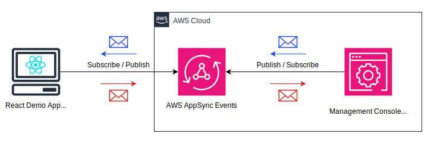

# AppSync Events Demo: Real-time Communication with AWS AppSync

[日本語の情報(for Japanese)](https://blog.msysh.me/posts/2024/11/appsync-events-without-amplify.html)

This project is a demonstration of a simple and minimal implementation of real-time communication using [AWS AppSync Events](https://docs.aws.amazon.com/ja_jp/appsync/latest/eventapi/event-api-welcome.html). It has been achieved without using Amplify.

This demo shows a React web app as a front-end client and a Pub/Sub client on the management console communicating via AppSync Events.

The architecture is as follows:




## Repository Structure

```
.
├── backend
├── doc
├── frontend
└── README.md
```

* **backend**: CDK project to deploy cloud resources for AppSync Events, API Key, and so on.
* **frontend**: A React web application as a front-end client by Vite.
* **doc**: Images and so on, for this documentation.

### Key Files:

- `backend/bin/backend.ts`: Entry point for the CDK application
- `backend/lib/stack.ts`: Defines the AWS infrastructure stack
- `frontend/src/App.tsx`: Main React component implementing real-time functionality
- `frontend/vite.config.ts`: Vite configuration for the frontend build

### Important Integration Points:

- AppSync API: The backend creates an AppSync API with event configuration
- WebSocket Connection: The frontend establishes a WebSocket connection to the AppSync real-time endpoint

## Usage Instructions

### Backend Installation

1. Navigate to the `backend` directory:
   ```
   cd backend
   ```

2. Install dependencies:
   ```
   pnpm install
   ```

3. Deploy the stack:
   ```
   cdk deploy
   ```

4. Note the output values for AppSync HTTP Endpoint, Realtime Endpoint, API Key, and Channel Namespace.

### Frontend Installation

1. Navigate to the `frontend` directory:
   ```
   cd frontend
   ```

2. Install dependencies:
   ```
   pnpm install
   ```

3. Update the `VITE_APPSYNC_HTTP_ENDPOINT`, `VITE_APPSYNC_REALTIME_ENDPOINT`, `VITE_APPSYNC_API_KEY`, and `VITE_APPSYNC_CHANNEL_NAMESPACE` environment values in `.env` file with the values from the backend deployment.
   ```bash
   # Specify the value of `OutputAppSyncHttpEndpoint` from cdk output
   VITE_APPSYNC_HTTP_ENDPOINT=<AppSync Http Endpoint>

   # Specify the value of `OutputAppSyncRealtimeEndpoint` from cdk output
   VITE_APPSYNC_REALTIME_ENDPOINT=<AppSync Realtime Endpoint>

   # Specify the value of `OutputAppSyncApiKey` from cdk output
   VITE_APPSYNC_API_KEY=<AppSync API Key>

   # Specify the value of `OutputAppSyncChannelNamespace` from cdk output
   VITE_APPSYNC_CHANNEL_NAMESPACE=default
   ```

4. Start the development server:
   ```
   pnpm run dev
   ```

## Demonstration operation

### at AWS Management Console

1. Open AppSync, and select the API.
2. Select the "Pub/Sub Editor" tab.
3. In the "Subscribe" section, "connect" and Channel "Subscribe".

### at React web app

1. Open the application in a web browser.
2. Enter a channel name in the "Channel" input field.
3. Click "Subscribe" to subscribe to the channel.
4. Enter a message in the "Publish Message" input field.
5. Click "Publish Message" to send the message to the subscribed channel.

Then, you can observe real-time updates in the Management Console. You can also try to publish from Management Console and receive at the React web application.

## License

Apache-2.0 license
